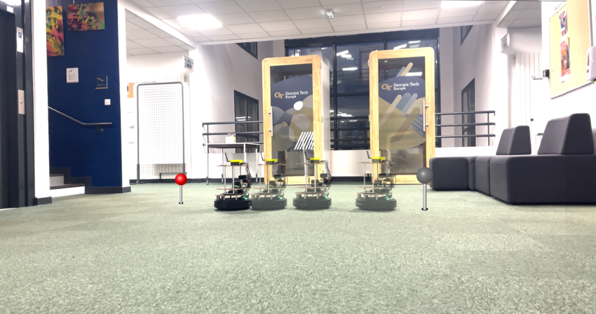
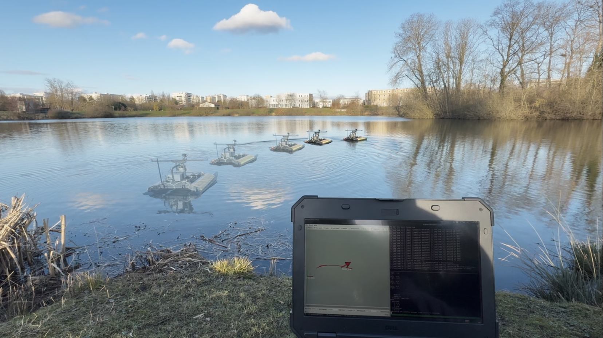
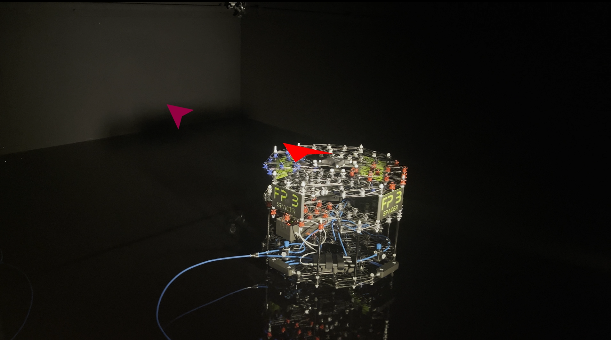

| Turtlebot 2              | Kingfisher            | Floating platform                 |
| :---------------- | :--------------: | :-------------------: |
| <div align="center"></div>            |   <div align="center"></div>     |   <div align="center"></div>    |

# RL Task State Creation and Inference Framework

This repository extends the [RobRAN-Code](https://github.com/snt-spacer/RobRAN-Code) to provide a modular and scalable framework for creating RL task states, running inference, and simulating robot control tasks. The system supports seamless integration with ROS, Docker, and a simulated OptiTrack environment for rapid testing and deployment.

## Features

- **State Creation Node**: Computes the RL policy input (state vector) for a selected task and robot.
- **Model Inference Node**: Subscribes to the state topic, runs the RL policy, and publishes actions to control the robot.
- **Goal Generator Node**: Created goals for the tasks generated in the Model Inference.
- **Simulated OptiTrack Data**: Generates synthetic pose updates to test the framework without real hardware.
- **Dockerized Setup**: Ensures consistent environments for development, testing, and deployment.


## Prerequisites
- Install [Docker](https://docs.docker.com/get-docker/):

## Setup
Every robot has a low-level controller, follow the readme for the type of robot you want to run:
- Floating Platform ([link](https://github.com/SpaceR-x-DreamLab-RL/RANS_low_level_robot_control))

ssh to your robot, build and run the container:
>[!Important]
> Some robots use different builds. See list below:
> Floating platform: `buld_L4T.sh` and `run_L4T.sh`
> Kinki: `build_cyclone_laptop.sh` and `run_cyclone_laptop.sh`

```
git clone
cd 
./docker/build.sh
./docker/run.sh
```

Once inside the container, split the terminal (tmux, byobu).

- **Terminal 1**

  Create your launch file in `src/rl_inference/launch/<robot>/<name>_launch.py` and run it, e.i. :
  ```
  ros2 laucnh rl_inference fp_optitrack_SKRL_GoToPose_launch.py
  ```

- **Terminal 2**
  Run Joy from ROS2 to listen to joystick inputs
  ```
  ros2 run joy joy_node
  ```

- **Terminal 3**

  Create your launch file in `src/goal_generator/launch/<robot>/<name>_launch.py` and run it, e.i. :
  ```
  ros2 launch goal_generator fp_GoToPose_launch.py
  ```

> [!Note]
> Make sure you have the correct remapping of the ros2 topics inside the launch files.

### Robot Specific Setup
Every robot might need extra things, they are described below.

#### Floating Platform
1. Clean and pressurize ZeroG lab.
2. Calibrate Optitrack ([link](https://docs.optitrack.com/quick-start-guides/quick-start-guide-getting-started)).
  > [!Note]
  > Make sure to turn off the LED from the cameras once calibrated. It will help with the reflection on the ground to create the RigidBody and accuracy.
3. Run Optitrack node

    Open a third terminal to run optitrack ([vrpn_mocap](https://index.ros.org/r/vrpn_mocap/))

    - **Terminal 3**
      ```
      ros2 launch vrpn_mocap client.launch.yaml server:=192.168.88.13
      ```